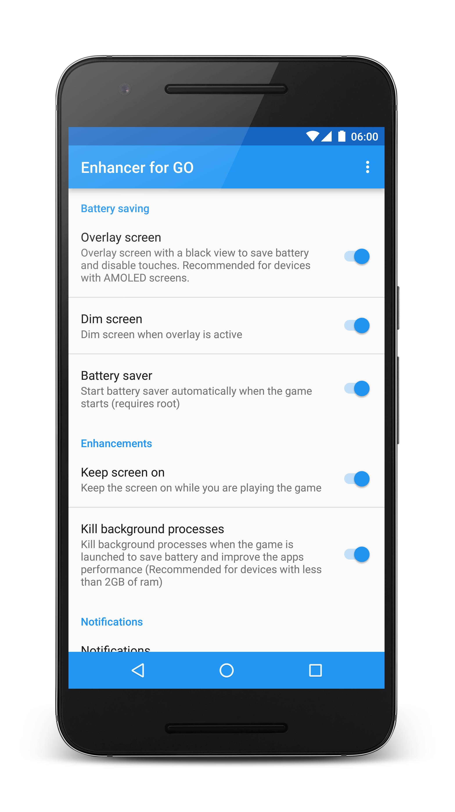
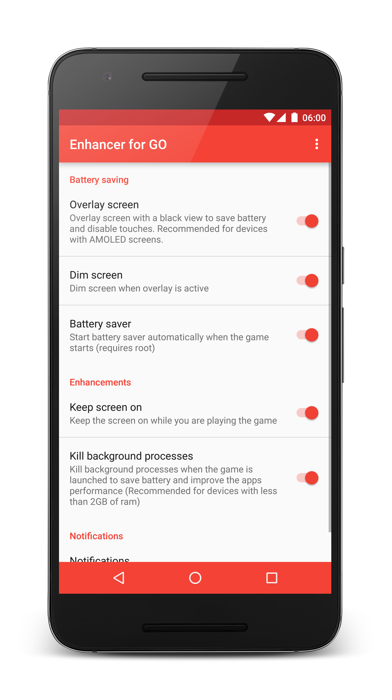
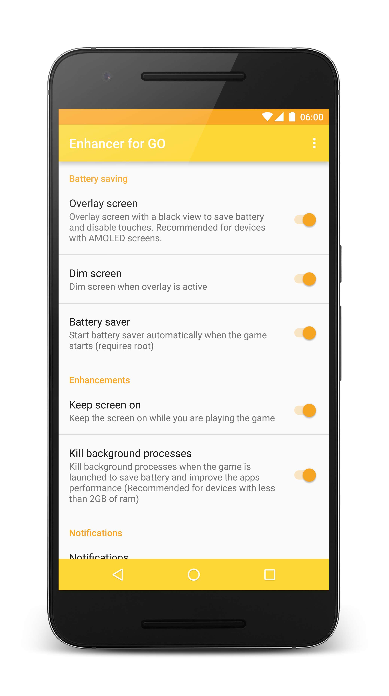

# notifications-for-pokemon-go

### The app is no longer in the Google Play store. If you have donated, send me an Email or a private message with your order number and I'll refund your purchase.

I created 2 Pokemon GO related apps, Notifications for GO and [Enhancements for GO](https://github.com/rosenpin/Enhancer-For-GO).
Even though neither have violated Ninatics TOS, Enhancements for GO was suspended from the Google Play Store 3 days after being uploaded for "Impersonation and Intellectual Property". You can read more about it [here](https://github.com/rosenpin/Enhancer-For-GO/issues/22).

Suspenions are a pretty big deal for developers, as explained in [this Google support page](https://support.google.com/googleplay/android-developer/answer/2477981?hl=en)
App suspensions:

> * Count as strikes against the good standing of your Google Play Developer account.
> * Egregious or multiple policy violations can result in suspension, as can repeated app rejections or removals.

> ####After a suspension
> Once your app is suspended, you forfeit the users, statistics, and ratings of the removed application. If your developer credentials are still in good standing with Google Play and if your app allows for it, you can publish a new compliant version of the application.

In other words, you really don't want to get your app suspended, and definitely don't want more than one of your apps to be suspended.

After [Enhancements for GO](https://github.com/rosenpin/Enhancer-For-GO) was suspended from the Google Play Store, I decided to merge the apps functionality into Notifications For GO (which at the time was still available in the Play Store) to be fair to users who donated and supported the development.

A few days after I published the udpate that included the migration, Niantic updated Pokemon GO and removed the "API" I based my notifications on.
A few hours later I saw [this post](https://www.reddit.com/r/TheSilphRoad/comments/4vzvn2/im_smart_poke_dev_my_google_account_has_been/) by the developer of Smart Poke.
Seems like he/she removed the text of the OP but it basically stated that it was his/her first violation in the Google Play Store and that Google has terminated his account without much hope of getting it back.

After reading this post I decided to remove Notifications for GO from the Play Store without hesitation. I can't afford to count on Niantic/Google to not mistake my app with an app that violates Niantics TOS and get another suspenstion (and likely lose my developer account)

I uploaded the [APK to the releases page in this repo](https://github.com/rosenpin/notifications-for-pokemon-go/releases) so you can still download it if you want.
But I understand if you want to request a refund, so if you do, please email me.

| Mystic | Valor  | Instinct |
|:-:|:-:|:-:|
|  |  |  |

##Contributing
You can view a list of known issues and feature requests using [the issue tracker](
https://github.com/rosenpin/notifications-for-pokemon-go/issues). If you don't see your issue (or you
aren't sure) feel free to [submit it!](https://github.com/rosenpin/notifications-for-pokemon-go/issues/new)

#### Early releases testing
Join the early testing channel [right here](https://play.google.com/apps/testing/com.tomer.poke.notifier) to get the latest updates first. These updates might be unstable.

## Licensing
Notifications & more for GO is licensed under the [GNU v3 Public License.](LICENSE)
